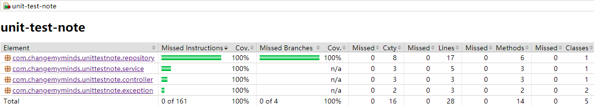

# Spring Boot 單元測試筆記

## 環境

- Win10
- Gradle Version 6.4
- Intellij IDEA Community 2020.2

[TOC]

## JUnit5單元測試

### Gradle設定

```groovy
dependencies {
    // 其他省略
    testImplementation('org.springframework.boot:spring-boot-starter-test') {
        // 排除JUnit Platform上運行的JUnit3和JUnit4測試引擎
        exclude group: 'org.junit.vintage', module: 'junit-vintage-engine'
    }
}
```

### 常用註解

- `@ExtendWith(SpringExtension.class)` 啟用`@Autowired`、`@MockBean`
  等等，可以用來取代JUnit4 `@RunWith(SpringJUnit4ClassRunner.class)`的方式。
- `@ExtendWith(MockitoExtension.class)` 啟用`@Mock`、`@InjectMocks`
  等等，且不涉及到Spring的注入功能，可以用來取代JUnit4 `@RunWith(MockitoJUnitRunner.class)`的方式。
- `@DisplayName` 用來補充說明方法名稱。
- `@Test` 測試方法，也可以在內容標記Exception，例如: `@Test(expected = Exception.class)`。
- `@BeforeEach` 表示在任何方法執行前，都會先執行一次，用來取代JUnit4`@Before`。
- `@BeforeAll` 表示在執行測試前，會執行一次，用來取代JUnit4`@BeforeClass`，需使用static method。
- `@AfterEach` 表示在任何方法執行後，都會先執行一次，用來取代JUnit4`@After`。
- `@AfterAll` 表示在執行測試後，會執行一次，用來取代JUnit4`@AfterClass`，需使用static method。
- `@RepeatedTest` 重複測試方法用。
- `@TestFactory` 用來動態產生測試實體。只能回傳`Stream`、`Collection`、`Iterable`、`Iterator`等亂數實體。
- `@AutoConfigureMockMvc` 啟動的時候自動注入`MockMvc`，可以用來模擬Http Restful(GET、POST、DELETE2等等)。

#### 額外補充

1. 如果`@BeforeAll`、`@AfterAll`沒有將上`static`的話，會報錯，錯誤如下

```
org.junit.platform.commons.JUnitException: @BeforeAll method 'public void com.changemymind.blog.controller.AuthControllerTests.setup()' must be static unless the test class is annotated with @TestInstance(Lifecycle.PER_CLASS).
```

**解決方法**
使用`@TestInstance(TestInstance.Lifecycle.PER_CLASS)`

```java
@TestInstance(TestInstance.Lifecycle.PER_CLASS)
public class SampleTests {
    @BeforeAll
    public void beforeAll() {
        // ...
    }

    @AfterAll
    public void afterAll() {
        // ...
    }
}
```

### 常用Mockito

- `Mockito.mock()` 產生一個空殼的物件，需要搭配`when()`來定義方法。
- `@Mock` + `@ExtendWith(MockitoExtension.class)`相當於`Mockito.mock()`。
- `@MockBean` SpringBoot的單元測試，主要是用來替換掉Spring注入的物件，需搭配`@ExtendWith(SpringExtension.class)`。
- `@InjectMocks` 可以將`@Mock`注入到指定的物件內，通常需要搭配設定`MockitoAnnotations.initMocks(this)`來觸發注入。
- `Mockito.when()` 自訂Mock物件的行為和回傳結果。
- `ArgumentMatchers.any()`、`ArgumentMatchers.anyString()`等等 自訂Mock傳入的任意型別(參數)，通常搭配`Mockito.when()`。
- `MockitoAnnotations.initMocks(this)`  會將`@Mock`、`@InjectMocks`等等物件進行初始化，防止NullPointerException。

### 常用Assertions

一般再撰寫單元測試時，有關於jupiter.api盡量採用`import static`的方式取代`Assertions`的使用

```java
// 平常寫法
Assertions.assertEquals(expected, actual);

// 建議寫法
import static org.junit.jupiter.api.Assertions.assertEquals;
assertEquals(expected, actual);
```

- `assertAll(...)` 判斷多個數值的結果。
- `assertEquals()` 判斷數值是否相等。
- `assertThrows()` 當某個方法會拋出異常時，使用此方式進行比對Exception。
- `assertTrue()`、`assertFalse()` 判斷結果是否為真。
- `verify()` 判斷某個方法是否有被執行過。

使用`AssertJ`的`assertThat()`風格寫法

- `assertEquals`轉換

```java
assertEquals(actual, expected);
assertThat(actual).isEqualTo(expected); // AssertJ
```

- `assertThrows`轉換

```java
assertThrows(Exception.class, () -> exception());
assertThatThrownBy(() -> exception()).isInstanceOf(Exception.class); // AssertJ
```

- `assertTrue()`和`assertFalse()`轉換

```java
assertTrue(actual);
assertThat(actual).isTrue();

assertFalse(actual);
assertThat(actual).isFalse(); 
```

### 其他

#### 順序執行
```java
@TestMethodOrder(MethodOrderer.OrderAnnotation.class)
public class TestMethodOrderTests {
    @Test
    @Order(3)
    public void test3(){
        System.out.println("test3");
    }

    @Test
    @Order(2)
    public void test2(){
        System.out.println("test2");
    }

    @Test
    @Order(1)
    public void test1(){
        System.out.println("test1");
    }
    
    // Result: 
    // test1
    // test2
    // test3    
}
```

#### 禁用單元測試
- `@DisabledIf`
- `@EnabledIf`
- `@EnabledIfEnvironmentVariable`
- `@DisabledIfEnvironmentVariable`
- `@EnabledIfSystemProperty()`
- `@DisabledIfSystemProperty()`
 

### 測試RESTful API

在單元測試類別上加上`@SpringBootTest`、`@AutoConfigureMockMvc`等修飾詞。 下列方式進行簡單的演示`GET`、`POST`方法

```java
@SpringBootTest
@AutoConfigureMockMvc
public class AppUserControllerTest {
    @Autowired private MockMvc mockMvc;

    @Test
    @DisplayName("找尋存在的使用者資訊")
    public void findByUsernameExist() throws Exception {
        mockMvc.perform(get("/api/user/{username}", "changemyminds"))
                .andDo(print())
                .andExpect(status().isOk())
                .andExpect(jsonPath("$.id").value(1L))
                .andExpect(jsonPath("$.username").value("changemyminds"))
                .andExpect(jsonPath("$.password").value("1234"))
                .andExpect(jsonPath("$.age").value(27));
    }
	
    @Test
    @DisplayName("創建使用者")
    public void createAppUser() throws Exception {
        AppUser appUser = new AppUser("海倫", "7788", 8);
        String requestJson = toJson(appUser);

        getCreateAppUserPerform(requestJson)
                .andDo(print())
                .andExpect(status().isCreated())
                .andExpect(jsonPath("$.id").value(4L))
                .andExpect(jsonPath("$.username").value(appUser.getUsername()))
                .andExpect(jsonPath("$.password").value(appUser.getPassword()))
                .andExpect(jsonPath("$.age").value(appUser.getAge()));
    }	
    
    private ResultActions getCreateAppUserPerform(String requestJson) throws Exception {
        return mockMvc.perform(post("/api/user").headers(createHttpHeaders()).content(requestJson));
    }

    private HttpHeaders createHttpHeaders() {
        HttpHeaders httpHeaders = new HttpHeaders();
        httpHeaders.add("Content-Type", "application/json");
        return httpHeaders;
    }	
}
```

上方的中文字"海倫"在Console顯示是亂碼，因此需要修正，新增下列方式來處理

```java
@Configuration
public class SpringConfig implements WebMvcConfigurer {

    @Override
    public void configureMessageConverters(List<HttpMessageConverter<?>> converters) {
        converters.stream()
                .filter(converter -> converter instanceof MappingJackson2HttpMessageConverter)
                .findFirst()
                .ifPresent(converter -> ((MappingJackson2HttpMessageConverter) converter).setDefaultCharset(UTF_8));
    }
}
```

## 單元測試報告Jacoco設定

某些情況下，我們需要單元測試覆蓋率測試報告，此時就可以使用Jacoco來幫助我們產生報告。

### Gradle安裝

```groovy
plugins {
    // 其他省略
    id 'jacoco'     
} 

// 其他省略

test {
    useJUnitPlatform()
    finalizedBy jacocoTestReport // 測試完畢後產生report
}

jacoco {
    toolVersion = '0.8.5' // jacoco版本
//	reportsDir = file("$buildDir/customJacocoReportDir") // 自訂jacoco報告資料夾
}

jacocoTestReport {
    dependsOn test // 再產生報告前需要先運行測試

    reports {
        xml.enabled false
        csv.enabled false
//		html.destination file("${buildDir}/jacocoHtml")
    }

    // 測試評估後的動作
    afterEvaluate {
        classDirectories.from = files(classDirectories.files.collect {
            // 要忽略domain資料夾、UnitTestNoteApplication檔案。
            fileTree(dir: it, excludes: ['**/domain/**', '**/UnitTestNoteApplication**'])
        })
    }
}
```

### 執行jacoco，產生報告

執行jacoco時，比較容易遇到的問題就是產生的報告是亂碼，因為中文字而造成。 因此需要使用JVM的參數來設定UTF-8來避免此問題。

```
-Dfile.encoding=UTF-8
```

解決方式如下

- 使用IDEA執行 Help => Edit Custom VM Options => 開啟202.6948.69.vmoptions <br>
  將`-Dfile.encoding=utf-8`加入後，重新啟動IDEA。

> **補充**<br>
如果重新啟動IDEA後，執行仍然有亂碼問題，解決方式如下 <br>
File => Invalidate Caches / Restart => 點選Invalidate and Restart，此方式會清除Cache並重新啟動。

- 使用gradlew執行

```
# 使用此方式執行，如果有包含中文產生出來會是亂碼
gradlew clean build

# 可以使用UTF-8參數進行編碼，這樣不會產生亂碼
gradlew -Dfile.encoding=UTF-8 clean build
```

### 結果顯示



## 參考

- [@ExtendWith(SpringExtension.class) vs @ExtendWith(MockitoExtension.class)](https://stackoverflow.com/questions/60308578/extendwithspringextension-class-vs-extendwithmockitoextension-class)
- [Jacoco Gradle 6.7.1官方文件](https://docs.gradle.org/current/userguide/jacoco_plugin.html)
- [JUint5官方文件](https://junit.org/junit5/docs/current/user-guide/)
- [Junit-5](https://www.baeldung.com/junit-5-runwith)
- [Jacoco報告解析](https://www.jianshu.com/p/ef987f1b6f2f)
- [中文亂碼問題](https://testerhome.com/topics/8329?order_by=like&)
- [單元測試字串亂碼](https://stackoverflow.com/questions/58525387/mockmvc-no-longer-handles-utf-8-characters-with-spring-boot-2-2-0-release)


